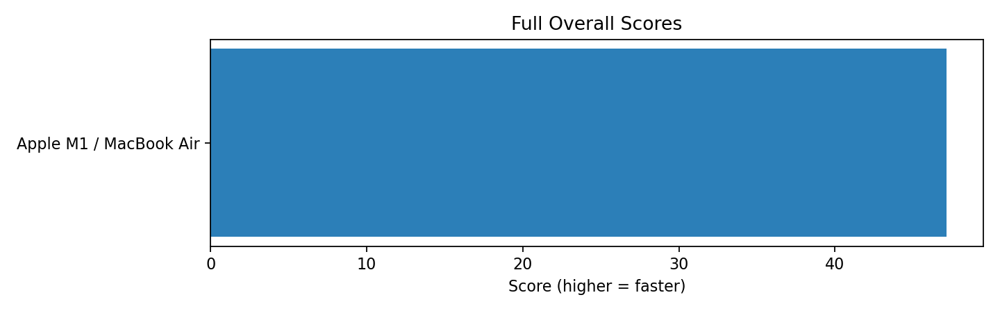
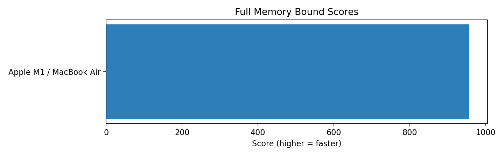
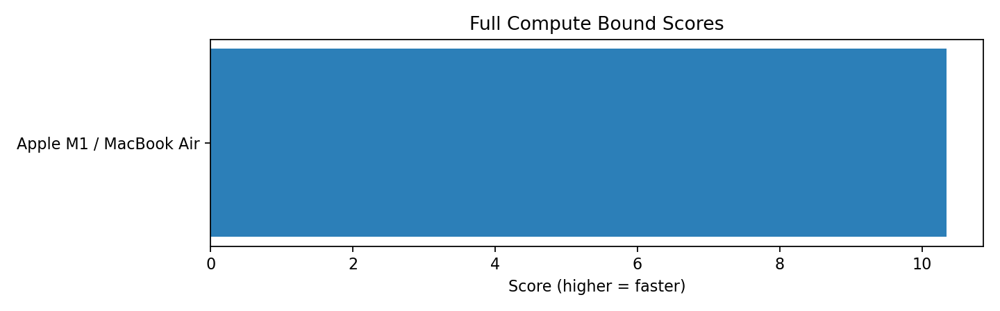

# Benchmark Summary

*Generated: 2026-03-25T14:24:46*

This summary compares the latest saved run for each machine within each profile.

## Profile `full`

| Machine | Overall | Single Threaded | Parallel | Memory Bound | Compute Bound | Latest Run | Result File |
| --- | ---: | ---: | ---: | ---: | ---: | --- | --- |
| Apple M1 / MacBook Air | 47 | 25 | 20 | 957 | 10 | 2026-03-25T19:47:16.322353+00:00 | `apple-m1-macbook-air_full_20260325_141656.json` |

